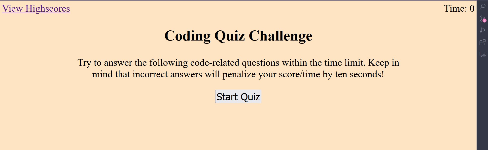

# javascript-quiz

<!-- PROJECT LOGO -->
 

  <h3 align="center">Javascript Quiz</h3>
 
  

    Challenge 4 on Javascript Quiz.

  

## Demo
 

  
Demo picture(click to show)

(<a href="#readme-top">back to top</a>)

<!-- ABOUT THE PROJECT -->
## About The Project

### portfolio summary:
<li>Used JS to create a quiz app that takes user's input and shows a score;
<li>Created links that connect two html files;
<li>Showed questions dynamically with constant style;
<li>Used localstorage to store scores.

(<a href="#readme-top">back to top</a>)

<!-- LICENSE -->
## License

Distributed under the MIT License. See `LICENSE.txt` for more information.

(<a href="#readme-top">back to top</a>)

<!-- CONTACT -->
## Contact

Lantao Zhang - lantaook@gmail.com

Project Link: [https://pppzlt.github.io/javascript-quiz/](https://pppzlt.github.io/javascript-quiz/)

(<a href="#readme-top">back to top</a>)

